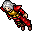

```{r}
#| include: false
#| warning: false

library(DBI)
library(RSQLite)
library(dplyr)

# Database connection
con <- DBI::dbConnect(RSQLite::SQLite(), "../../asset/demonax-test.sqlite")

# Read all necessary tables
creatures <- dbReadTable(con, "creatures")
creature_skills <- dbReadTable(con, "creature_skills")
creature_spells <- dbReadTable(con, "creature_spells")
creature_loot <- dbReadTable(con, "creature_loot")
creature_flags <- dbReadTable(con, "creature_flags")
items <- dbReadTable(con, "items")
item_prices <- dbReadTable(con, "item_prices")
npc_locations <- dbReadTable(con, "npc_locations")

# Close database connection
DBI::dbDisconnect(con)

# Helper function to generate NPC map links (vectorized)
generate_npc_map_link <- function(npc_name, x, y, z) {
  mapply(function(name, x_coord, y_coord, z_coord) {
    if (is.na(name) || is.na(x_coord) || is.na(y_coord) || is.na(z_coord)) {
      return(name)
    }
    zoom <- 5
    hash <- sprintf("#%d,%d,%d,%d?crosshair=1&npcs=1", x_coord, y_coord, z_coord, zoom)
    url <- sprintf("/map/index.html%s", hash)
    return(sprintf('<a href="%s" style="color: #004294; text-decoration: none; font-weight: 500;">%s</a>',
                   url, name))
  }, npc_name, x, y, z, USE.NAMES = FALSE)
}

# Query 1: Creature base data
creature <- creatures |>
  filter(id == 72)

# Query 2: Creature skills
skills_data <- creature_skills |>
  filter(creature_id == 72) |>
  select(Skill = skill_name, Value = skill_value) |>
  arrange(Skill)

# Query 3: Creature spells/attacks
spells_data <- creature_spells |>
  filter(creature_id == 72) |>
  mutate(damage = ifelse(
    is.na(min_value),
    "",
    paste0(min_value, " to ", max_value))
   ) |>
  select(
    Spell = spell_name,
    `Damage type` = damage_type,
    Damage = damage,
    Range = range
  ) |>
  arrange(Spell)

# Query 4: Creature flags
flags_data <- creature_flags |>
  filter(creature_id == 72)

# Helper function to generate behavior text from flags
generate_behavior_text <- function(flags_df, creature_name, creature_article) {
  flags <- flags_df$flag_name
  sentences <- c()

  # Capitalize first letter of creature name and article
  creature_name_cap <- paste0(toupper(substring(creature_name, 1, 1)), substring(creature_name, 2))

  # Handle article (empty for proper names like "Ferumbras")
  if (is.na(creature_article) || creature_article == "") {
    full_name <- creature_name_cap
  } else {
    article_cap <- paste0(toupper(substring(creature_article, 1, 1)), substring(creature_article, 2))
    full_name <- paste(article_cap, creature_name_cap)
  }

  # Movement behavior
  movement_parts <- c()
  if ("KickBoxes" %in% flags) movement_parts <- c(movement_parts, "move items")
  if ("KickCreatures" %in% flags) movement_parts <- c(movement_parts, "move other creatures")
  if (length(movement_parts) > 0) {
    sentences <- c(sentences, paste0(full_name, " will ",
                                     paste(movement_parts, collapse = " and "),
                                     " during combat."))
  }

  # Perception
  if ("SeeInvisible" %in% flags) {
    sentences <- c(sentences, "They see invisible creatures.")
  }

  # Combat
  if ("DistanceFighting" %in% flags) {
    sentences <- c(sentences, "They fight from a distance.")
  }
  if ("NoHit" %in% flags) {
    sentences <- c(sentences, "They are immune to physical damage.")
  }

  # Resistances
  resist_parts <- c()
  if ("Unpushable" %in% flags) resist_parts <- c(resist_parts, "pushed")
  if ("NoParalyze" %in% flags) resist_parts <- c(resist_parts, "paralyzed")
  if (length(resist_parts) > 0) {
    sentences <- c(sentences, paste0("They cannot be ",
                                     paste(resist_parts, collapse = " or "),
                                     "."))
  }

  # Damage immunities
  damage_immune <- c()
  if ("NoBurning" %in% flags) damage_immune <- c(damage_immune, "fire")
  if ("NoPoison" %in% flags) damage_immune <- c(damage_immune, "poison")
  if ("NoEnergy" %in% flags) damage_immune <- c(damage_immune, "energy")
  if ("NoLifeDrain" %in% flags) damage_immune <- c(damage_immune, "life drain")
  if (length(damage_immune) > 0) {
    if (length(damage_immune) == 1) {
      sentences <- c(sentences, paste0("They are immune to ", damage_immune, "."))
    } else {
      last <- damage_immune[length(damage_immune)]
      rest <- damage_immune[-length(damage_immune)]
      sentences <- c(sentences, paste0("They are immune to ",
                                       paste(rest, collapse = ", "),
                                       ", and ", last, "."))
    }
  }

  # Control immunities
  control_immune <- c()
  if ("NoSummon" %in% flags) control_immune <- c(control_immune, "summoned")
  if ("NoConvince" %in% flags) control_immune <- c(control_immune, "convinced")
  if ("NoIllusion" %in% flags) control_immune <- c(control_immune, "illusioned")
  if (length(control_immune) > 0) {
    if (length(control_immune) == 1) {
      sentences <- c(sentences, paste0("They cannot be ", control_immune, "."))
    } else {
      last <- control_immune[length(control_immune)]
      rest <- control_immune[-length(control_immune)]
      sentences <- c(sentences, paste0("They cannot be ",
                                       paste(rest, collapse = ", "),
                                       ", or ", last, "."))
    }
  }

  return(paste(sentences, collapse = " "))
}

# Generate behavior text
behavior_text <- if (nrow(flags_data) > 0) {
  generate_behavior_text(flags_data, creature$name, creature$article)
} else {
  NULL
}

# Hardcoded currency values
currency_prices <- data.frame(
  item_id = c(3031, 3035, 3043),
  name = c("Gold Coin", "Platinum Coin", "Crystal Coin"),
  currency_price = c(1, 100, 10000)
)

# Query 4: Loot table with item details and prices
loot_data <- creature_loot |>
  filter(creature_id == 72) |>
  left_join(items, by = c("item_id" = "type_id")) |>
  left_join(
    item_prices |> filter(mode == "sell") |> group_by(item_id) |> summarize(price = max(price)),
    by = c("item_id")
  ) |>
  left_join(
    item_prices |>
      filter(mode == "sell") |>
      left_join(npc_locations, by = "npc_name") |>
      group_by(item_id) |>
      summarize(
        npc_name = first(npc_name),
        sell_price = max(price),
        npc_x = first(x),
        npc_y = first(y),
        npc_z = first(z),
        .groups = "drop"
      ),
    by = c("item_id")
  ) |>
  left_join(currency_prices |> select(item_id, currency_price), by = "item_id") |>
  mutate(
    final_price = coalesce(currency_price, price, 0),
    avg_amount = (min_amount + max_amount) / 2,
    avg_value = round(avg_amount * final_price * (chance_percent / 100), 0),
    sell_to = ifelse(
      !is.na(npc_name) & !is.na(sell_price),
      paste0(
        generate_npc_map_link(npc_name, npc_x, npc_y, npc_z),
        " (", sell_price, " gp)"
      ),
      ""
    ),
    Image = paste0(''),
    Amount = ifelse(
      min_amount != max_amount,
      paste0(min_amount, " - ", max_amount),
      min_amount
    )
  ) |>
  select(` ` = Image, Item = name, Amount, `Chance (%)` = chance_percent, `Avg. value` = avg_value, `Sell to` = sell_to) |>
  arrange(desc(`Chance (%)`))

# Calculate total average value per kill
total_avg_value <- creature_loot |>
  filter(creature_id == 72) |>
  left_join(items, by = c("item_id" = "type_id")) |>
  left_join(
    item_prices |> filter(mode == "sell") |> group_by(item_id) |> summarize(price = max(price)),
    by = c("item_id")
  ) |>
  left_join(currency_prices |> select(item_id, currency_price), by = "item_id") |>
  mutate(
    final_price = coalesce(currency_price, price, 0),
    avg_amount = (min_amount + max_amount) / 2,
    avg_value = avg_amount * final_price * (chance_percent / 100)
  ) |>
  summarize(total = sum(avg_value, na.rm = TRUE)) |>
  pull(total)

# Create stats table
stats_data <- data.frame(
  Statistic = c("HP", "Experience", "Avg. value", "Avg. value per exp.", "Avg. value per HP"),
  Value = c(
    as.character(creature$hp),
    as.character(creature$experience),
    paste0(round(total_avg_value), " gp"),
    paste0(format(round(total_avg_value / creature$experience, 3), nsmall = 3), " gp"),
    paste0(format(round(total_avg_value / creature$hp, 3), nsmall = 3), " gp")
  )
)
```

<div style="margin-bottom: 1.5rem;">
  <a href="/qmd/library/creatures.html"
     id="back-link"
     style="color: #cfa600; text-decoration: none; font-weight: 500; font-size: 1rem;"
     onclick="handleBack(event)">
    ← Back
  </a>
</div>

<script>
function handleBack(event) {
  const referrer = document.referrer;
  const currentHost = window.location.host;

  if (referrer && referrer.includes(currentHost)) {
    event.preventDefault();
    window.history.back();
  }
}
</script>

::: {.creature-profile}
::: {.profile-container}
::: {.profile-photo}
{width=50%}
:::

::: {.profile-info}

```{r}
#| echo: false
knitr::kable(stats_data,
      col.names = NULL,
      escape = FALSE,
      format = "html",
      table.attr = 'class="profile-table"') |>
  kableExtra::kable_styling(full_width = TRUE) |>
  kableExtra::column_spec(1, bold = TRUE)

```
:::
:::
:::

```{r}
#| echo: false
#| results: asis

if (!is.null(behavior_text)) {
  cat("\n### Behavior & Traits\n\n")
  cat('<div class="creature-behavior">\n')
  cat(behavior_text, "\n")
  cat('</div>\n\n')
}
```

::: {.panel-tabset}

### Loot

```{r}
#| echo: false
#| warning: false

if (nrow(loot_data) > 0) {
  DT::datatable(loot_data,
            options = list(pageLength = 15, searching = FALSE),
            rownames = FALSE,
            escape = FALSE)
} else {
  cat("No loot data available.")
}
```

### Magic

```{r}
#| echo: false
#| warning: false

if (nrow(spells_data) > 0) {
  DT::datatable(spells_data,
            options = list(pageLength = 10, searching = FALSE),
            rownames = FALSE)
} else {
  cat("No use of magic recorded.")
}
```

:::
