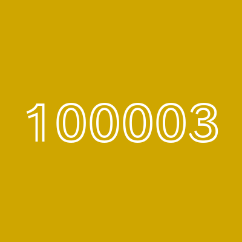

<div style="margin-bottom: 1.5rem;">
  <a href="/qmd/pmx/people.html" style="color: #cfa600; text-decoration: none; font-weight: 500; font-size: 1rem;">
    ← Back to People
  </a>
</div>

```{r}
#| echo: false
#| warning: false
library(DBI)
library(RSQLite)
library(knitr)
library(kableExtra)

# Fetch employee data from database
con <- dbConnect(RSQLite::SQLite(), "../../assets/data/site_data.db")
employee <- dbGetQuery(con, "
  SELECT * FROM employees
  WHERE employee_id = 100003
")
dbDisconnect(con)

# Create the profile data for the table
profile_data <- data.frame(
  Field = c("Employee ID", "Department", "Role", "Years of Experience",
            "Projects Completed", "Active Projects", "Utilization",
            "Email", "Phone", "Location"),
  Value = c(
    as.character(employee$employee_id),
    employee$department,
    employee$role,
    as.character(employee$years_experience),
    as.character(employee$projects_completed),
    as.character(employee$active_projects),
    paste0(employee$utilization, "%"),
    paste0('<a href="mailto:', employee$email, '">', employee$email, '</a>'),
    employee$phone,
    employee$location
  )
)
```

::: {.employee-profile}
::: {.profile-container}
::: {.profile-photo}

:::

::: {.profile-info}
```{r}
#| echo: false
kable(profile_data,
      col.names = NULL,
      escape = FALSE,
      format = "html",
      table.attr = 'class="profile-table"') %>%
  kable_styling(full_width = TRUE)
```
:::
:::
:::

::: {.panel-tabset}

### Quantum

```{r}
#| echo: false
#| warning: false
library(DBI)
library(RSQLite)
library(DT)

con <- dbConnect(RSQLite::SQLite(), "../../assets/data/site_data.db")
quantum_data <- dbGetQuery(con, "
  SELECT
    task_name AS 'Task Name',
    completion_date AS 'Completion Date',
    complexity_score AS 'Complexity Score'
  FROM achievements_quantum
  WHERE employee_id = 100003
  ORDER BY completion_date DESC
")
dbDisconnect(con)

datatable(quantum_data,
          options = list(pageLength = 10, searching = FALSE),
          rownames = FALSE)
```

### Server

```{r}
#| echo: false
#| warning: false
library(DBI)
library(RSQLite)
library(DT)

con <- dbConnect(RSQLite::SQLite(), "../../assets/data/site_data.db")
server_data <- dbGetQuery(con, "
  SELECT
    server_name AS 'Server Name',
    action_type AS 'Action',
    date_completed AS 'Date'
  FROM achievements_server
  WHERE employee_id = 100003
  ORDER BY date_completed DESC
")
dbDisconnect(con)

datatable(server_data,
          options = list(pageLength = 10, searching = FALSE),
          rownames = FALSE)
```

### Code

```{r}
#| echo: false
#| warning: false
library(DBI)
library(RSQLite)
library(DT)

con <- dbConnect(RSQLite::SQLite(), "../../assets/data/site_data.db")
code_data <- dbGetQuery(con, "
  SELECT
    repository AS 'Repository',
    lines_of_code AS 'Lines of Code',
    commits AS 'Commits'
  FROM achievements_code
  WHERE employee_id = 100003
  ORDER BY commits DESC
")
dbDisconnect(con)

datatable(code_data,
          options = list(pageLength = 10, searching = FALSE),
          rownames = FALSE)
```

### Achievements

```{r}
#| echo: false
#| warning: false
library(DBI)
library(RSQLite)
library(DT)

con <- dbConnect(RSQLite::SQLite(), "../../assets/data/site_data.db")
achievements_data <- dbGetQuery(con, "
  SELECT
    achievement_name AS 'Achievement',
    category AS 'Category',
    date_achieved AS 'Date Achieved'
  FROM achievements_general
  WHERE employee_id = 100003
  ORDER BY date_achieved DESC
")
dbDisconnect(con)

datatable(achievements_data,
          options = list(pageLength = 10, searching = FALSE),
          rownames = FALSE)
```

:::
